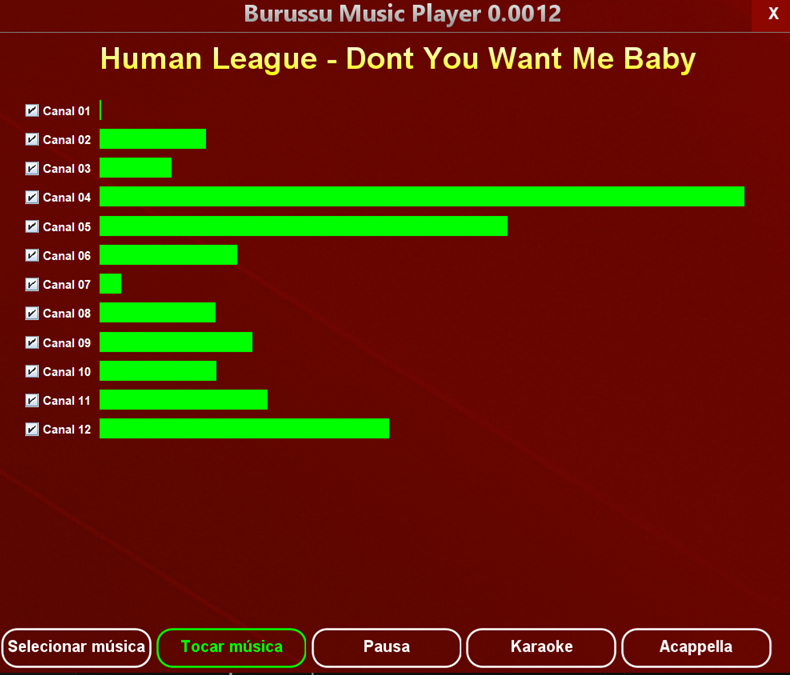

# Burussu Music Player
## 🛠️ Project Description



Burussu Music Player (BMP) is a simple educational example of a Java Swing application that allows to play music files through the use of Threads. The app  allows the user to toggle the channels that make up the music, to experience the music in different ways (Acapella, Karaoke, or just some of the instruments of the music).

Sound data format can be configured by the user in the code. 

Future versions might allow different mixing of instruments in real time, as well as recording.

## How to clone and run

1. Open a terminal and run the command to clone the repository:
```bash
git clone <REPOSITORY_URL> Burussu_Music_Player
```
2. Enter the project directory:
```bash
cd Burussu_Music_Player
```
3. Compile the source code:
```bash
javac -d bin -sourcepath src src/io/github/mauriciobraga/burussumusicplayer/app/Burussu_App.java
```
4. Run the application:
```bash
java -cp bin io.github.mauriciobraga.burussumusicplayer.app.Burussu_App
```


> Note: This is a Java application, so you need to have the JDK installed and the `JAVA_HOME` variable configured to compile and run the project.

## How to use

Burussu loads multitrack music using wave files. 

Multitrack music files are audio recordings in which each instrument, voice, or musical element is saved separately on its own track (or channel). This allows you to isolate, adjust the volume of, add effects to, or alter the sound of each element individually, rather than listening to the music as a single, fixed block.


## Thanks

- David Brackeen (wrote the initial multithread sound engine that was adapted / modified in order to be used in this project).
